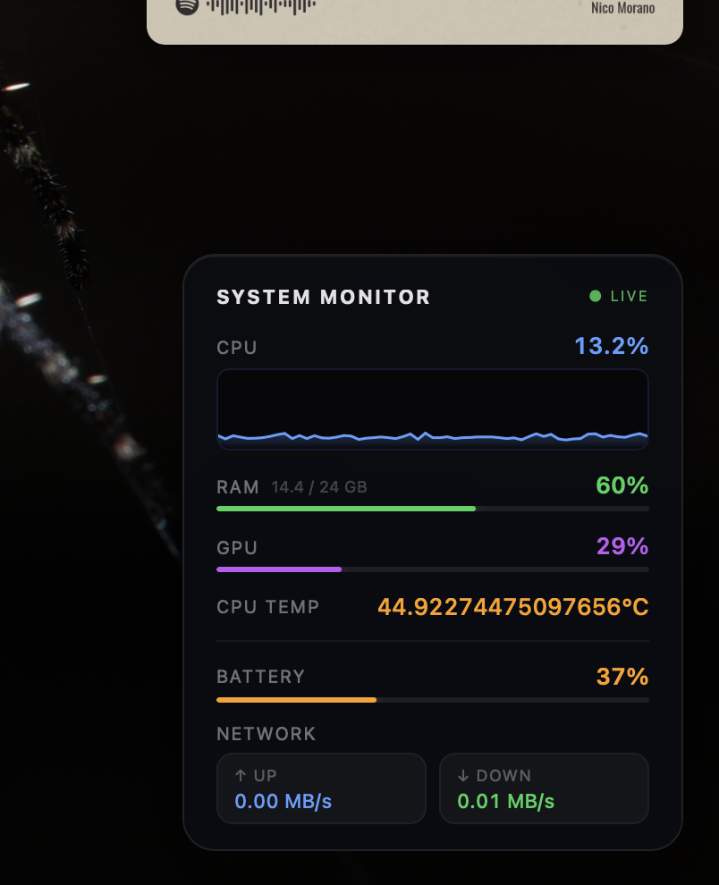

# System Monitor Widget for Übersicht

A dark, minimal system monitor widget for macOS Übersicht. Displays live system stats including CPU usage with animated line graph, GPU usage, RAM usage (used/total GB), CPU temperature, battery percentage with charging indicator, and network upload/download speed. Updates every 5 seconds. Built with JavaScript and a shell script backend using native macOS commands.



## Features

- 📊 Live CPU usage with animated moving graph
- 🎮 GPU usage percentage
- 💾 RAM usage with total GB display
- 🌡️ CPU temperature
- 🔋 Battery percentage with charging indicator
- 🌐 Network upload & download speed
- 🔄 Auto-updates every 5 seconds
- 🎨 Sleek dark semi-transparent card design

## Requirements

- macOS with Apple Silicon (M1 / M2 / M3 / M4)
- [Übersicht](https://tracesof.net/uebersicht/) installed
- [macmon](https://github.com/vladkens/macmon) for CPU temperature (no sudo required):

```bash
brew install macmon
```

## Installation

1. Download or clone this repository.
2. Copy the `system_monitor.widget` folder into your Übersicht widgets directory:

```
~/Library/Application Support/Übersicht/widgets/
```

3. Übersicht will load the widget automatically. It appears in the **bottom-right corner** of your desktop.

## Configuration

Open `index.jsx` to adjust:

| Constant | Default | Description |
|---|---|---|
| `refreshFrequency` | `3000` | Poll interval in milliseconds |
| `MAX_HISTORY` | `60` | Number of CPU graph data points |
| `ACCENT / GREEN / ORANGE / RED / PURPLE` | — | Theme colors |

The widget position (`bottom: 20px; right: 20px`) can be changed in the `className` export in `index.jsx`.

## How It Works

`stats.sh` runs on every refresh and outputs a single JSON object containing all metrics. It uses:

- `top` — CPU usage
- `vm_stat` — RAM usage
- `ioreg` — GPU utilization
- `macmon pipe` — CPU temperature (Apple Silicon, no sudo)
- `pmset` — battery status and charging state
- `netstat` — network throughput (two samples, ~1 second apart)

`index.jsx` parses the JSON and renders the UI using Übersicht's built-in JSX/React layer.

## License

MIT
